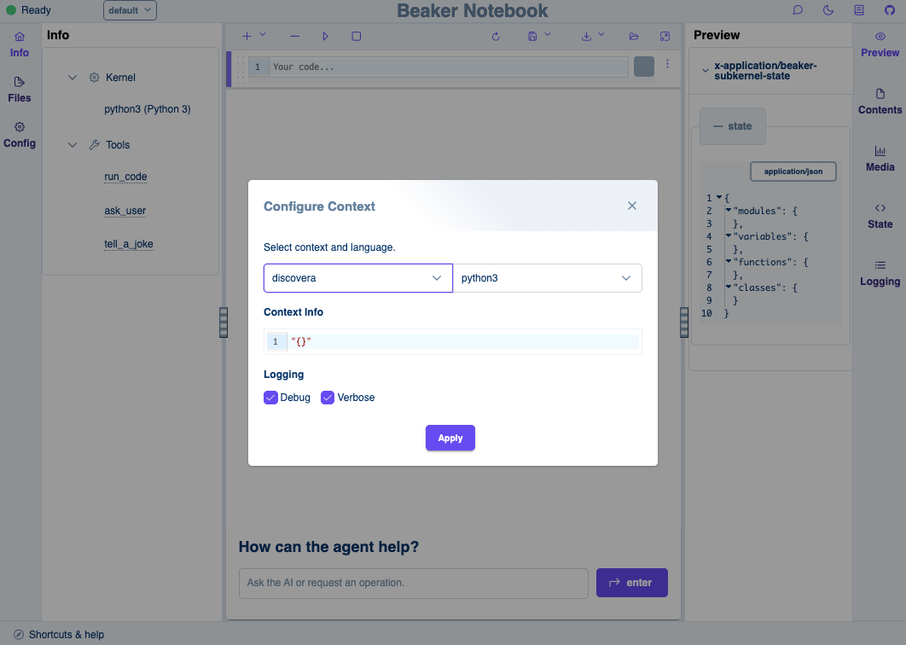

# 🧬 Gene Set Function Discovery with LLM-based Agents and Knowledge Retrieval

[](https://www.python.org/)
[]()


Discovera is an interactive, agent-based system that integrates traditional bioinformatics tools with large language models (LLMs) and retrieval-augmented generation (RAG) to support hypothesis generation and mechanistic discovery in functional genomics.

**Presented at** *ICLR 2025 MLGenX Workshop*

🔗 [Read the Paper](https://openreview.net/pdf?id=mpvp5KP8fR) · 🖼️ [View the Poster](https://iclr.cc/media/PosterPDFs/ICLR%202025/37062.png?t=1746410988.3281965)


## What It Does?

Bridges the gap between computational analysis and interpretability in biomedical research. It is designed to assist researchers—regardless of their coding expertise—in:

- Interactively exploring gene sets associated with complex phenotypes  
- Conducting functional enrichment analyses  
- Summarizing mechanistic hypotheses using evidence from literature  
- Formulating data-grounded biological insights  

## Key Features

- ⚙️ **Modular System**: Combines established tools (e.g., GSEApy, INDRA) with custom modules for extensibility.  
- 📖 **LLM Integration**: Uses LLMs for natural language reasoning and explanation generation.  
- 🔎 **Retrieval-Augmented Generation**: Grounds summaries in real literature to improve accuracy and transparency.  
- 💬 **Chat Interface**: Enables intuitive, dialogue-based exploration of hypotheses and gene set functions.  

## Use Case Example

In our initial deployment, this agent was used in the context of **endometrial carcinoma (EC)** to:

- Analyze gene sets linked to phenotypic features  
- Perform enrichment analysis on the resulting sets  
- Summarize literature-supported mechanisms of action  

## System Architecture

<p align="center">
  
</p>

The system consists of:
- Enrichment tools (e.g., GSEApy)  
- INDRA for biological statement synthesis  
- LLM-enabled prompt orchestration  
- Chat-based user interface  

## Getting Started

### Prerequisites

- Python 3.8+  
- [GSEApy](https://gseapy.readthedocs.io/)  
- [INDRA](https://indra.readthedocs.io/)  
- OpenAI or similar LLM API access

## Getting Started

### Prerequisites

- Python 3.8+
- Docker & Docker Compose
- OpenAI API key (for LLM integration)

### Installation and Setup

Clone the repository:

```bash
git clone https://github.com/VIDA-NYU/discovera.git
cd discovera
```

### Configure Beaker

Copy the configuration template:

```bash
cp .beaker.conf.template .beaker.conf
```

Open .beaker.conf in a text editor and add your OpenAI API key, if using OpenAI:

```ini
api_key = "your-api-key-here"
```

This configuration will be used when launching Docker.

### Running with Docker

To use Discovera with the Beaker context setup:

```bash
docker compose build
docker compose up -d
```

Once running, navigate to [http://localhost:8888](http://localhost:8888) and select `discovera`.


<p align="center">
  
</p>


## Example Workflow

Try the following steps to see how BKD-Agent assists in biomedical discovery:

1. **Load Gene Expression Data**  
   - Load `gene_expression.csv` into a Pandas DataFrame.

2. **Gene Set Enrichment Analysis (GSEA)**  
   - Use the following parameters:  
     - `gene_sets`: `GO_Biological_Process_2023`  
     - `hit_column`: `hit`  
     - `corr_column`: `corr`  
     - `min_set`: `5`  
     - `max_set`: `2000`

3. **Identify Lead Genes from Top Pathway**  
   - Extract lead genes from the most statistically significant pathway.

4. **Refine Gene List Based on Correlation**  
   - Identify top 20 most correlated genes, excluding those already in the lead gene set.

5. **Retrieve Documented Gene Relationships**  
   - Example gene pair: `["CTNNB1", "GLCE"]`

6. **Summarize Gene Pair Relationship Types and Frequencies**  
   - Example pairs:  
     - `["CTNNB1", "GLCE"]`  
     - `["CTNNB1", "NOTUM"]`

7. **Construct Gene Network Graph**  
   - Nodes = genes, edges = literature-backed relationships weighted by frequency/strength

8. **Extract Gene Relationship Excerpts**  
   - Retrieve textual evidence supporting the relationships.

9. **Contextualize Gene Relationships in Disease (Endometrial Carcinoma)**  
   - Analyze how gene interactions relate to the disease context.  
   - Use GSEA results, pathway data, and literature to generate hypotheses.  
   - Ask:  
     > Can you summarize these excerpts in the context of prospective endometrial carcinoma?  
     > What hypotheses can be drawn from this analysis?

10. **Suggest Future Research Directions**  
    - Propose:  
      - Novel hypotheses  
      - Drug targets or pathway interventions  
      - Further bioinformatics studies (e.g., single-cell RNA-seq)

## Extending BKD-Agent: Adding Tools

Currently, the agent has one tool: `query_gene_pair` defined in:

```
src/discovera/agent.py
```

To add more tools:

- Copy the format of `query_gene_pair`.
- Tools are registered with `@tool` from Archytas.
- Archytas expects arguments as string variable names, not DataFrames directly.
- For example, this will correctly pass a variable and a string:

```python
query_gene_pair({{ dataset }}, target="{{ target }}", method="{{ method }}")
```

- The underlying code executed lives in:

```
procedures/python3/query_gene_pair.py
```

## Prompt Modification

There are two main areas to adjust the agent's behavior:

1. **Context Management**  
   - File: `src/discovera/context.py`  
   - Modify the `auto_context` function to alter background knowledge or enumerate tools.

2. **Prompt Customization**  
   - File: `agent.py`  
   - The main system prompt is written in the `BKDAgent` docstring.

Use these to tweak how the agent interprets user queries, formats responses, and integrates with tools.

[^iclr]: Discovera was presented at the [ICLR 2025 MLGenX Workshop](https://mlgenx.github.io/) on April 27, 2025.


